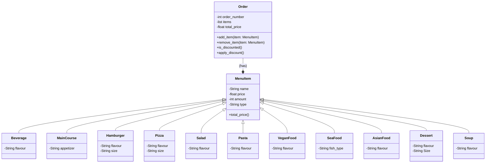

```mermaid
classDiagram
    direction TB
    class MenuItem {
	    -String name
	    -float price
	    -int amount
	    -String type
	    +total_price()
    }

    class Beverage {
	    -String flavour
    }

    class MainCourse {
	    -String appetizer
    }

    class Hamburger {
	    -String flavour
	    -String size
    }

    class Pizza {
	    -String flavour
	    -String size
    }

    class Salad {
	    -String flavour
    }

    class Pasta {
	    -String flavour
    }

    class VeganFood {
	    -String flavour
    }

    class SeaFood {
        -String fish_type
    }

    class AsianFood {
        -String flavour
    }

    class Dessert {
	    -String flavour
	    -String Size
    }

    class Soup {
	    -String flavour
    }

    class Order {
        -int order_number
        -list items
        -float total_price
        +add_item( item: MenuItem )
        +remove_item( item: MenuItem )
        +is_discounted()
        +apply_discount()
    }

    MenuItem <|-- Beverage
    MenuItem <|-- MainCourse
    MenuItem <|-- Hamburger
    MenuItem <|-- Pizza
    MenuItem <|-- Salad
    MenuItem <|-- Pasta
    MenuItem <|-- VeganFood
    MenuItem <|-- SeaFood
    MenuItem <|-- AsianFood
    MenuItem <|-- Dessert
    MenuItem <|-- Soup
    Order --* MenuItem: (has)
```
